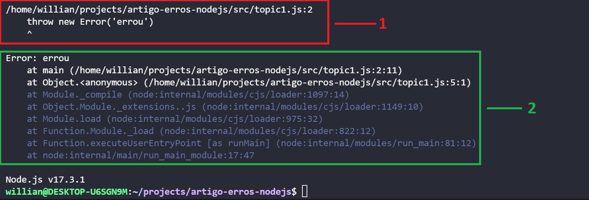
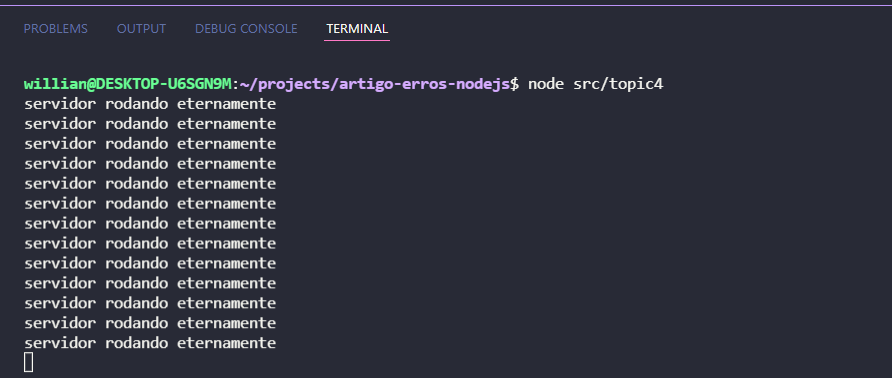
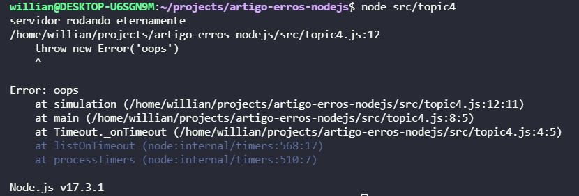
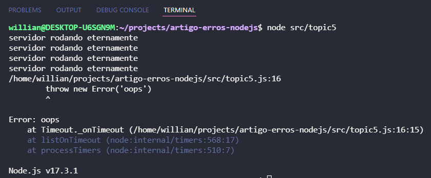

# Entendendo erros para criar soluções (Node JS)

Quando estamos desenvolvendo software é de suma importância entender os erros que dão na aplicação, pois ao entender os erros conseguimos criar melhores soluções.

O objetivo deste artigo é entender os erros em Nodejs seguindo os seguintes tópicos:

1. Como ler um log de erro.
2. Analisando o objeto Error. 
3. Tipos de erros em nodejs.
4. Como tratar um erro.
5. Erros em código assíncronos.
6. Erros customizados.


## 1 - Como ler um log de erro.

Vamos gerar um erro executando o seguinte código Javascript:

```javascript
function main() {
    throw new Error('errou')
}

main()
```

Temos uma função "main" que apenas dispara um erro genérico no nodejs, vejamos abaixo o resultado da execução deste código:



Podemos separar um erro em nodejs em duas partes:

1- Mostra exatamente o arquivo e linha onde foi disparado o erro.

O erro ocorreu no arquivo "topic1.js" : (na linha) na linha número dois.

*/home/willian/projects/artigo-erros-nodejs/src/topic1.js:2*

Exatamente o código que gerou o erro.

*throw new Error('errou')*

2- Mostra o nome do erro com a mensagem e toda a stack do erro.

NomeErro : Mensagem, no caso mostrou o erro genérico "Error" e a mensagem "errou".

*Error: errou*

Logo abaixo do nome do erro é mostrada a stack de error, desde onde o erro foi disparado até os módulos internos do node.

Obs. Stack é todo o caminho que o seu código percorreu até gerar o erro.

*at main (/home/willian/projects/artigo-erros-nodejs/src/topic1.js:2:11)
 at Object.<anonymous> (/home/willian/projects/artigo-erros-nodejs/src/topic1.js:5:1)
 at Module._compile (node:internal/modules/cjs/loader:1097:14)
 at Object.Module._extensions..js (node:internal/modules/cjs/loader:1149:10)
 at Module.load (node:internal/modules/cjs/loader:975:32)
 at Function.Module._load (node:internal/modules/cjs/loader:822:12)
 at Function.executeUserEntryPoint [as runMain] (node:internal/modules/run_main:81:12)
 at node:internal/main/run_main_module:17:47*

 Bom, até agora vimos que ao disparar um erro em nodejs ele informa no console da aplicação algumas informações sobre este erro, vamos ver agora um pouco mais sobre o objeto Error do nodejs.

## 2 - Analisando o objeto Error.

Vamos analisar o seguinte código:

```javascript
function main() {
    const erro = new Error('errou')
    console.log('Mensagem de erro: ' + erro.message)
    console.log('Stack do erro: ' + erro.stack)
    console.log('Nome do erro: ' + erro.name)
}

main()
```

O "Error" em nodejs é um objeto que possui várias propriedades, entre elas:

- message: mensagem do erro;
- stack: stack do erro;
- name: nome do erro;

## 3 - Tipos de erros em nodejs.

Passando rapidamente pelos tipos de erros em nodejs, temos a seguinte lista:

- Error: erro genérico;
- AssetionError: é um erro disparado quando estamos criando testes em nodejs e o teste falha, então o erro de asserção é disparado;
- RangeError: quando passamos um valor para uma função que está fora do range que a função espera;
- ReferenceError: quando fazemos referência a uma variável ou função que não existe;
- SintaxError: quando escrevemos código com algum erro de sintaxe;
- SystemError:esse erro é disparado quando acontece algum problema no ambiente em tempo de execução;
- TypeError: é disparado quando uma função espera um determinado tipo de dado e é enviado outro tipo, então é disparado o erro de Tipo;

## 4 - Como tratar um erro.

Vamos analisar o código abaixo:

```javascript
//simulando um serviço que fica rodando eternamente
setInterval(() => {
    console.log('servidor rodando eternamente')
    main()
}, 500)

function main() { }
```
Ao executar o código temos a seguinte saída:



Temos uma simulação de serviço que fica rodando eternamente, mas agora fica a dúvida, se caso um erro estourar nesta aplicação, O que acontece?



Um erro não tratado faz com que a nossa aplicação fique fora do ar, já imaginou o seu software fora do ar? Como podemos resolver isto?

Vamos aprender a capturar e tratar erros.

### Bloco Try Catch

Para capturar e tratar erros em javascript podemos utilizar a sintaxe do bloco try catch, vamos analisar a solução abaixo:

```javascript
setInterval(() => {
    console.log('servidor rodando eternamente')
    main()
}, 500)

function main() { 
    try {
        //simula uma chamada para uma função que pode retornar erro
        simulation()
    } catch (error) {
        console.log(error)
    }
}

function simulation(){
    throw new Error('oops')
}
```

Dentro da função "main" envolvemos a chamada para a função "simulation" com o bloco try catch, o funcionamento deste bloco é bem simples, tudo o que pode dar erro você coloca dentro do "try" e no "catch" podemos fazer o tratamento desde erro:
Quando falamos "tratamento de erro" pode ser simplesmente realizar um console.log, utilizar alguma biblioteca de log, salvar estes logs em algum arquivo, ou até mesmo usar um serviço de gerenciamento de logs e monitoramento, como por exemplo o [Sentry](https://sentry.io/welcome/).

Agora ao executar a aplicação ele mostra no console o erro mas a aplicação continua viva.

## 5 - Erros em código assíncrono

Adicionamos na função "simulation" um timeOut, que agenda uma chamada de função e dispara um erro.
Agora a nossa função "simulation" tem um código assíncrono:

```javascript
setInterval(() => {
    console.log('servidor rodando eternamente')
    main()
}, 500)

function main() { 
    try {
        simulation()
    } catch (error) {
        console.log(error);
    }
}

function simulation(){
    setTimeout(() => {
        throw new Error('oops')
    }, 2000);
}
```

Tá, mas qual é o problema disso? Já estamos realizando o tratamento do erro na função "main" que chama a função "simulation", a aplicação deveria continuar funcionando normalmente, não é?

vamos dar uma olhada no console:



A aplicação parou, vamos entender o porquê:

Quando criamos uma tarefa assíncrona e não esperamos o resultado desta tarefa, ela será executada fora do seu contexto original, no nosso exemplo a função "simulation" está dentro do bloco "try catch", porém como ela é assíncrona e só executa depois de dois segundos, quando a função é executada ela perde o seu contexto original onde estava sendo tratado o erro, podemos analisar pela stack retornada, conseguimos visualizar que a função rodou diretamente dentro do módulo de eventos do nodejs.

Como podemos resolver este problema?

```javascript
setInterval(() => {
    console.log('servidor rodando eternamente')
    main()
}, 500)

async function main() { 
    try {
        await simulation()
    } catch (error) {
        console.log(error);
    }
}

function simulation(){
    return new Promise((resolve, reject) => {
        setTimeout(() => {
            reject(new Error('oops'))
        }, 2000)
    })
}
```

Transformamos nossa função "simulation" em uma promise que retorna um error no "reject", e ao usar promises podemos esperar utilizando a palavra reservada "await", e consequentemente capturar o erro, pois a função "main" irá esperar o resultado da função "simulation" e quando a mesma retornar, ainda estaremos dentro do bloco "try catch" e conseguiremos tratar os erros permitindo com que a aplicação continuar o seu funcionamento normalmente.

Sempre que estiver executando uma função assíncrona que utiliza promise (se não for promise, transforme-a em promise), e queremos tratar/capturar o erro devemos envolver a chamada da função com "try catch" e utilizar a palavra "await" para esperar o retorno da função.
Ou ainda podemos utilizar a função "catch" para capturar/tratar o erro, igual no exemplo abaixo:

```javascript
function main() { 
    simulation().catch(error => {
        console.log(error)
    })
}
```

Neste exemplo tiramos o bloco "try catch" e passamos a utilizar a função ".catch" que toda a promise possui, ela permite capturar/tratar um erro (caso exista) na função assíncrona.

## 6 - Erros customizados.

Já pensou em criar erros customizados para a sua aplicação? vou te mostrar como fazer isso.
Primeiramente vamos analisar o seguinte código:

```javascript
function createUser(name, age, password) {
    try {
        userValidation(name, age, password)
        //código para cadastrar o usuário
    } catch (error) {
        console.log(error);
    }
}

function userValidation(name, age, password) {
    if(!name) {
        throw new Error('o nome é obrigatório')
    }

    if(!age || age < 0 || age > 120) {
        throw new Error('idade inválida')
    }

    if(password.length < 8 || password.length > 20) {
        throw new Error('a senha deve ter o tamanho de no mínimo 8 caracteres e no máximo 20')
    }
}

createUser('willian', 26, '12345678')
```

No código acima temos basicamente uma função "createUser" que irá cadastrar o usuário, está função chama uma função de validação dos dados "userValidation", está função valida os dados e dispara um Erro caso os dados tenham alguma inconsistência.

O código não está incorreto, porém podemos deixar o mesmo um pouco mais descritivo em relação aos erros disparados.
Vejamos a implementação abaixo:

```javascript
class InvalidNameError extends Error {
    constructor(){
        super('o nome é obrigatório')
    }
}

class InvalidAgeError extends Error {
    constructor(){
        super('idade inválida')
    }
}

class InvalidPasswordError extends Error {
    constructor(){
        super('a senha deve ter o tamanho de no mínimo 8 e no máximo 20 caracteres')
    }
}

function createUser(name, age, password) {
    try {
        userValidation(name, age, password)
    } catch (error) {
        console.log(error)
    }
}

function userValidation(name, age, password) {
    if(!name) {
        throw new InvalidNameError('o nome é obrigatório')
    }

    if(!age || age < 0 || age > 120) {
        throw new InvalidAgeError('idade inválida')
    }

    if(password.length < 8 || password.length > 20) {
        throw new InvalidPasswordError('a senha deve ter o tamanho de no mínimo 8 caracteres e no máximo 20')
    }
}

createUser('willian', 26, '12345678')
```

Podemos criar erros customizados utilizando a sintaxe de classe e extensão de características, caso queiram estudar um pouco mais sobre essa sintaxe leiam [aqui](https://developer.mozilla.org/pt-BR/docs/Web/JavaScript/Reference/Classes)

Basicamente, ao extender a classe "Error" podemos criar erros customizados, assim podemos dar mais sentido aos nossos erros da aplicação.

Show né?

Referências:

 - [NODEJS LEARN](https://nodejs.dev/learn/error-handling-in-nodejs)
 - [NODEJS DOCUMENTATION](https://nodejs.org/api/errors.html)


